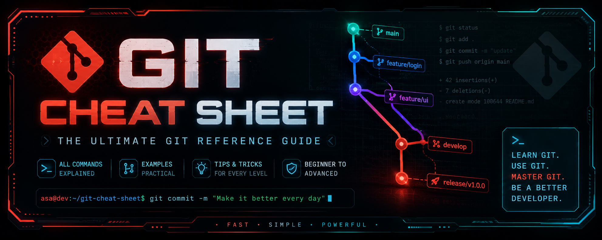
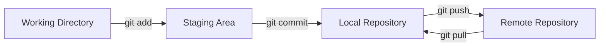

<p align="center">
  
</p>

<h1 align="center">
  Git Cheat Sheet 🚀
</h1>

<p align="center">
  A practical and beginner-friendly Git reference guide for developers.
</p>

<p align="center">


</p>

---

# About 📖

Git Cheat Sheet is a complete Git learning resource designed to help developers understand Git concepts, commands, and workflows.

This project focuses on learning Git properly instead of only memorizing commands.

It provides clear explanations, practical examples, and professional development practices that can be used in real-world projects.

---

# Why This Project? 🤔

Git is one of the most important tools in modern software development.

However, many Git cheat sheets only provide command lists without explaining:

- What each command does
- When to use it
- Why it is important
- How it fits into a professional workflow

Git Cheat Sheet solves this problem by providing structured documentation for beginners and developers who want to improve their Git skills.

---

# Features ✨

- ✅ Beginner-friendly Git explanations
- ✅ Practical command examples
- ✅ Real-world Git workflows
- ✅ Branching and merging guides
- ✅ GitHub workflow documentation
- ✅ Troubleshooting common problems
- ✅ Git recovery techniques
- ✅ Professional Git best practices
- ✅ Clean documentation structure

---

# Documentation 📚

Explore the complete Git guides:

| Topic | Description |
|---|---|
| Installation | Installing Git on different operating systems |
| Configuration | Setting up Git preferences |
| Repositories | Creating and managing repositories |
| Commits | Understanding commits and commit history |
| Branches | Working with Git branches |
| Merging | Combining branches safely |
| Rebasing | Managing project history |
| Remotes | Working with remote repositories |
| Stash | Temporarily saving changes |
| Tags | Managing project versions |
| History | Exploring Git history |
| Undo | Recovering from mistakes |
| Aliases | Creating Git shortcuts |
| GitHub | Using Git with GitHub |
| Troubleshooting | Solving common Git problems |
| Best Practices | Professional Git workflow |

---

# Quick Access 🚀

## Getting Started

- [Installation Guide](./docs/installation.md)
- [Configuration Guide](./docs/configuration.md)

## Core Git Concepts

- [Repositories](./docs/repositories.md)
- [Commits](./docs/commits.md)
- [Branches](./docs/branches.md)
- [Merging](./docs/merging.md)
- [Rebasing](./docs/rebasing.md)

## Advanced Topics

- [Remotes](./docs/remotes.md)
- [Stash](./docs/stash.md)
- [Tags](./docs/tags.md)
- [History](./docs/history.md)
- [Undo](./docs/undo.md)
- [Aliases](./docs/aliases.md)

## GitHub & Maintenance

- [GitHub Guide](./docs/github.md)
- [Troubleshooting Guide](./docs/troubleshooting.md)
- [Best Practices Guide](./docs/best-practices.md)

---

# Project Structure 📁

```text
git-cheat-sheet
│
├── README.md
│
├── docs
│   ├── Git documentation
│   ├── Guides
│   └── Examples
│
├── images
│   └── Project assets
│
├── .github
│   └── Workflows
│
├── CHANGELOG.md
├── CONTRIBUTING.md
└── CODE_OF_CONDUCT.md
```

---

# Git Workflow Overview 🌳



---

# Contributing 🤝

Contributions are welcome.

You can help by:

- Improving documentation
- Fixing errors
- Adding examples
- Suggesting improvements
- Sharing feedback

Read the contribution guide:

[Contributing Guide](./CONTRIBUTING.md)

---

# Learning Goals 🎯

This project helps developers learn:

- How Git works internally
- How to manage project history
- How to collaborate using GitHub
- How to recover from mistakes
- How professional teams use Git

---

# Open Source 🌎

This project is open source and created for developers who want to improve their Git skills.

Everyone is welcome to learn, use, and contribute.

---

# License 📜

This project is licensed under the MIT License.

---

# Author 👨‍💻

Created by:

**AsaEdgerunner**

---

# Version 🚀

Current Version:

```
v1.0.0
```

---

# Final Words 💡

Git is not just a collection of commands.

It is a system for managing ideas, collaboration, and the evolution of software projects.

Learn the concepts, practice the workflow, and build better projects.

Happy coding! 🎉
